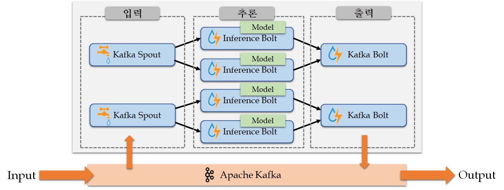

# 스톰 기반 실시간 분산 추론 시스템

실시간 데이터를 분산하여 추론하기 위한 스톰 기반 추론 시스템

### 동작 구조

<p align="center">

카프카 토픽에서 카프카 스파웃을 통해 데이텨를 입력받는다.
입력받은 데이터는 여러개 추론 볼트로 분산되어 추론된다.
마지막으로, 추론 결과는 카프카 볼트를 통해 토픽으로 최종 출력된다.

데이터가 빠른 속도로 생성되면 지연시간이 증가한다.
그러면 추론 볼트의 개수를 확장하여 시스템을 구축한다면, 지연시간은 줄어들 것이다.

이 시스템은 MNIST, CIFAR-10과 같은 이미지 분류 모델을 기반으로 하고 있다.
그에 따라, 4개의 차원을 기준으로 구현되어있다.
다른 차원의 데이터를 입력하려 한다면 `InstObj`의 `instances`변수를 수정하면 된다. 

### 데이터

##### 입력데이터 
```
{
    "instances" : []
}
```

##### 출력데이터 
```$xslt
{
    "predictions" : []
}
```

### 실행 방법
```
$ storm jar Inference-Model-based-Storm-1.0-SNAPSHOT-jar-with-dependencies.jar dke.model.MainTopology <TOPOLOGY_NAME> <INPUT_TOPIC> <OUTPUT_TOPIC>
```
+ `<TOPOLOGY_NAME>`: 실행할 토폴로지의 이름
+ `<INPUT_TOPIC>`: 카프카에서 데이터를 입력 받을 토픽 
+ `<OUTPUT_TOPIC>`: 카프카로 데이터를 출력할 토픽